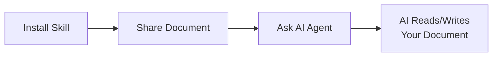

# Getting Started

Welcome to ExtraSuite! Connect your AI coding assistant to Google Workspace and start reading, analyzing, and editing spreadsheets, documents, and slides with natural language.

---

## Prerequisites

Before you begin, ensure you have the following ready:

### 1. AI Coding Assistant

Install one of the supported AI coding assistants:

| Platform | Requirements | Installation |
|----------|--------------|--------------|
| **Cursor** | Pro subscription | [cursor.com](https://cursor.com) |
| **Claude Code** | Pro or Team plan | [claude.ai/code](https://claude.ai/code) |
| **Codex CLI** | Plus plan or higher | [OpenAI Codex](https://openai.com/index/introducing-codex/) |
| **Gemini CLI** | Paid API key | [Gemini CLI](https://ai.google.dev/gemini-api/docs/aistudio-quickstart) |
| **Claude Coworks** | Pro or Team plan | [claude.ai/coworks](https://claude.ai/coworks) |

### 2. Terminal Application

You'll need terminal access for installation:

| Operating System | Recommended Terminal |
|-----------------|---------------------|
| **macOS** | Terminal (built-in) or iTerm2 |
| **Linux** | Terminal, Konsole, or your preferred terminal |
| **Windows** | PowerShell or Windows Terminal with WSL |

---

## Choose Your Setup Path

ExtraSuite supports two deployment models. Choose the one that fits your needs:

=== "For Organizations"

    **Best for:** Teams, companies, and enterprises
    
    Deploy ExtraSuite on your own Google Cloud infrastructure with full control over authentication, domain restrictions, and audit logging.
    
    **What you get:**
    
    - :material-check: Self-hosted on Google Cloud Run
    - :material-check: Domain-restricted authentication
    - :material-check: Automatic service account creation for users
    - :material-check: Centralized audit logging via Firestore
    - :material-check: Automatic token rotation (1-hour tokens)
    - :material-check: Multi-user support
    
    [:octicons-arrow-right-24: Start Organization Setup](organization-setup.md)

=== "For Individuals"

    **Best for:** Personal use, solo developers, experimentation
    
    Skip the server deployment. Create a Google Cloud service account directly and configure your AI agent to use it locally.
    
    **What you get:**
    
    - :material-check: No server required
    - :material-check: Quick setup in minutes
    - :material-check: Full control over your credentials
    - :material-check: Direct service account access
    
    [:octicons-arrow-right-24: Start Individual Setup](individual-setup.md)

---

## Quick Comparison

| Feature | Organizations | Individuals |
|---------|:-------------:|:-----------:|
| Server deployment | Required (Cloud Run) | Not needed |
| Sign-up flow | Yes (to your deployed server) | No |
| Service account creation | Automatic | Manual |
| Token expiration | 1-hour tokens | Long-lived keys |
| User management | Multi-user | Single user |
| Domain restrictions | Supported | N/A |
| Central audit logging | Firestore | N/A |
| Key rotation | Automatic | Manual |

---

## How It Works

Regardless of which path you choose, the workflow is the same once set up:



### Step-by-Step Overview

1. **Install the ExtraSuite Skill**  
   Run the install command to add Google Workspace capabilities to your AI agent.

2. **Share Your Document**  
   Share your Google Sheet, Doc, or Slides with your service account email.

3. **Ask Your AI Agent**  
   Describe what you need in natural language with the document URL.

4. **AI Works with Your Document**  
   Your AI agent reads, analyzes, or edits your document as requested.

---

## Quick Start (After Setup)

Once you've completed either setup path, here's how to use ExtraSuite:

### 1. Get Your Service Account Email

=== "Organizations"
    After signing in to your ExtraSuite server, your service account email is displayed on the homepage.

=== "Individuals"
    Your service account email is the one you created, e.g.:  
    `extrasuite-agent@your-project.iam.gserviceaccount.com`

### 2. Share Your Document

1. Open your Google Sheet, Doc, or Slides
2. Click **Share**
3. Paste your service account email
4. Choose permission level:
   - **Viewer** - Read-only access
   - **Commenter** - Can add comments  
   - **Editor** - Full read/write access
5. Click **Send**

### 3. Start Working

Open your AI agent and describe what you need:

```
Read the sales data from https://docs.google.com/spreadsheets/d/abc123/edit
and create a summary of Q4 revenue by region.
```

---

## Installation Guides

For detailed, platform-specific installation instructions:

<div class="grid cards" markdown>

-   :material-cursor-default-click:{ .lg .middle } **Cursor**

    ---

    AI-powered code editor with built-in agent skills.

    [:octicons-arrow-right-24: Installation Guide](installation/cursor.md)

-   :material-robot:{ .lg .middle } **Claude Code**

    ---

    Anthropic's AI coding assistant.

    [:octicons-arrow-right-24: Installation Guide](installation/claude-code.md)

-   :material-code-braces:{ .lg .middle } **Codex CLI**

    ---

    OpenAI's command-line coding assistant.

    [:octicons-arrow-right-24: Installation Guide](installation/codex.md)

-   :material-google:{ .lg .middle } **Gemini CLI**

    ---

    Google's AI coding assistant.

    [:octicons-arrow-right-24: Installation Guide](installation/gemini-cli.md)

</div>

See the [complete installation guide](installation/index.md) for all platforms including Windows-specific instructions.

---

## Next Steps

Choose your path and get started:

- **[Organization Setup](organization-setup.md)** - Deploy for your team
- **[Individual Setup](individual-setup.md)** - Quick personal setup
- **[Installation Guides](installation/index.md)** - Platform-specific instructions
- **[User Guide](../user-guide/index.md)** - Learn effective prompting techniques
