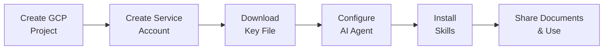

# Individual Setup

This guide is for developers who want to use ExtraSuite skills for personal use without deploying the full ExtraSuite server.

---

## Overview

For individual developers, you can skip the server deployment entirely. Instead, you:

1. Create a Google Cloud service account directly
2. Download the service account key (JSON file)
3. Configure your AI agent to use the key
4. Install the skills manually

This approach is simpler and faster, but requires you to manage the service account key yourself.



---

## Setup Steps

| Step | Action |
|------|--------|
| 1 | [Install Your AI Editor](#step-1-install-your-ai-editor) |
| 2 | [Create Google Cloud Project](#step-2-create-google-cloud-project) |
| 3 | [Enable Required APIs](#step-3-enable-required-apis) |
| 4 | [Create Service Account](#step-4-create-service-account) |
| 5 | [Download Service Account Key](#step-5-download-service-account-key) |
| 6 | [Configure Your AI Agent](#step-6-configure-your-ai-agent) |
| 7 | [Install the Skills](#step-7-install-the-skills) |
| 8 | [Share Documents & Start Using](#step-8-share-documents-and-start-using) |

---

## Step 1: Install Your AI Editor

Before setting up ExtraSuite, ensure you have an AI coding assistant installed.

=== "Cursor"

    1. Download and install from [cursor.com](https://cursor.com)
    2. Cursor Pro subscription recommended for full AI capabilities
    3. Open Cursor to verify installation
    
    [:octicons-arrow-right-24: Detailed Cursor Setup](installation/cursor.md)

=== "Claude Code"

    1. Install from [claude.ai/code](https://claude.ai/code)
    2. Requires Pro or Team plan
    3. Authenticate with your Anthropic account
    
    [:octicons-arrow-right-24: Detailed Claude Code Setup](installation/claude-code.md)

=== "Codex CLI"

    1. Install from [OpenAI Codex](https://openai.com/index/introducing-codex/)
    2. Requires Plus plan or higher
    3. Authenticate with your OpenAI account
    
    [:octicons-arrow-right-24: Detailed Codex Setup](installation/codex.md)

=== "Gemini CLI"

    1. Install from [Google AI](https://ai.google.dev/gemini-api/docs/aistudio-quickstart)
    2. Requires paid API key
    3. Configure your API key
    
    [:octicons-arrow-right-24: Detailed Gemini CLI Setup](installation/gemini-cli.md)

=== "Claude Coworks"

    1. Access at [claude.ai/coworks](https://claude.ai/coworks)
    2. Requires Pro or Team plan
    3. No additional installation needed
    
    [:octicons-arrow-right-24: Detailed Claude Coworks Setup](installation/claude-coworks.md)

---

## Step 2: Create Google Cloud Project

If you don't already have a Google Cloud project:

```bash
# Create a new project
gcloud projects create my-extrasuite-project

# Set it as the active project
gcloud config set project my-extrasuite-project
```

!!! note "Billing Required"
    Ensure billing is enabled for your project. Visit the [Cloud Console Billing page](https://console.cloud.google.com/billing) to set up billing.

---

## Step 3: Enable Required APIs

Enable the Google Workspace APIs that ExtraSuite needs:

```bash
gcloud services enable sheets.googleapis.com
gcloud services enable docs.googleapis.com
gcloud services enable slides.googleapis.com
gcloud services enable drive.googleapis.com
```

---

## Step 4: Create Service Account

Create a dedicated service account for your AI agent:

```bash
gcloud iam service-accounts create extrasuite-agent \
  --display-name="ExtraSuite AI Agent"
```

!!! tip "Service Account Email"
    Your service account email will be:  
    `extrasuite-agent@my-extrasuite-project.iam.gserviceaccount.com`
    
    Save this email - you'll need it to share documents.

---

## Step 5: Download Service Account Key

Create and download the JSON key file:

```bash
gcloud iam service-accounts keys create ~/extrasuite-key.json \
  --iam-account=extrasuite-agent@my-extrasuite-project.iam.gserviceaccount.com
```

!!! warning "Security: Protect Your Key File"
    This key file provides full access to the service account. Keep it secure:
    
    - :material-close: **Never** commit it to version control
    - :material-close: **Never** share it with others
    - :material-check: Store it in a secure location
    - :material-check: Consider encrypting it at rest
    - :material-check: Add it to your `.gitignore`
    
    ```bash
    # Add to .gitignore
    echo "extrasuite-key.json" >> ~/.gitignore
    ```

---

## Step 6: Configure Your AI Agent

Configure your AI agent to use the service account key.

=== "Cursor"

    Add the environment variable to your Cursor settings:
    
    1. Open Cursor Settings (`Cmd+,` or `Ctrl+,`)
    2. Search for "Environment"
    3. Add the variable:
    
    ```json
    {
      "terminal.integrated.env.osx": {
        "GOOGLE_APPLICATION_CREDENTIALS": "/Users/yourname/extrasuite-key.json"
      },
      "terminal.integrated.env.linux": {
        "GOOGLE_APPLICATION_CREDENTIALS": "/home/yourname/extrasuite-key.json"
      },
      "terminal.integrated.env.windows": {
        "GOOGLE_APPLICATION_CREDENTIALS": "C:\\Users\\yourname\\extrasuite-key.json"
      }
    }
    ```

=== "Claude Code"

    Add to your `.claude/settings.json`:
    
    ```json
    {
      "env": {
        "GOOGLE_APPLICATION_CREDENTIALS": "~/extrasuite-key.json"
      }
    }
    ```

=== "Codex CLI"

    Set the environment variable in your shell profile:
    
    ```bash
    # Add to ~/.bashrc, ~/.zshrc, or equivalent
    export GOOGLE_APPLICATION_CREDENTIALS=~/extrasuite-key.json
    ```
    
    Then reload your shell:
    
    ```bash
    source ~/.bashrc  # or ~/.zshrc
    ```

=== "Gemini CLI"

    Set the environment variable in your shell profile:
    
    ```bash
    # Add to ~/.bashrc, ~/.zshrc, or equivalent
    export GOOGLE_APPLICATION_CREDENTIALS=~/extrasuite-key.json
    ```
    
    Then reload your shell:
    
    ```bash
    source ~/.bashrc  # or ~/.zshrc
    ```

=== "Claude Coworks"

    Configure the environment variable in your project settings or shell.

---

## Step 7: Install the Skills

Download and install the ExtraSuite skills for your AI agent.

### Option A: Download Skills Manually

1. Download the skills from the [ExtraSuite GitHub repository](https://github.com/think41/extrasuite/tree/main/skills)

2. Extract to the appropriate location:

=== "Cursor"
    ```bash
    mkdir -p ~/.cursor/skills
    # Copy or clone the skills to ~/.cursor/skills/gsheets/
    ```

=== "Claude Code"
    ```bash
    mkdir -p ~/.claude/skills
    # Copy or clone the skills to ~/.claude/skills/gsheets/
    ```

=== "Codex CLI"
    ```bash
    mkdir -p ~/.codex/skills
    # Copy or clone the skills to ~/.codex/skills/gsheets/
    ```

=== "Gemini CLI"
    ```bash
    mkdir -p ~/.gemini/skills
    # Copy or clone the skills to ~/.gemini/skills/gsheets/
    ```

### Option B: Clone from GitHub

```bash
# Clone the repository
git clone https://github.com/think41/extrasuite.git /tmp/extrasuite

# Copy skills to your AI agent's skill directory
# Example for Cursor:
mkdir -p ~/.cursor/skills
cp -r /tmp/extrasuite/skills/gsheets ~/.cursor/skills/

# Clean up
rm -rf /tmp/extrasuite
```

### Verify Installation

Check that the skill files are in place:

```bash
ls ~/.cursor/skills/gsheets/  # or your agent's skill directory
```

You should see:

- `SKILL.md` - Instructions for the AI agent
- `checks.py` - Environment verification
- `verify_access.py` - Access verification
- `gsheet_utils.py` - Utility functions
- `requirements.txt` - Python dependencies

---

## Step 8: Share Documents and Start Using

### Share Your Document

1. Open your Google Sheet, Doc, or Slides

2. Click **Share** (top right)

3. Paste your service account email  
   (e.g., `extrasuite-agent@my-extrasuite-project.iam.gserviceaccount.com`)

4. Choose permission level:

   | Permission | What the Agent Can Do |
   |------------|----------------------|
   | **Viewer** | Read data, analyze content |
   | **Commenter** | Read + add comments |
   | **Editor** | Full read/write access |

5. Click **Send**

!!! tip "No Notification"
    Service accounts don't receive email notifications, so sharing happens silently.

### Start Working

Open your AI agent and describe what you need:

**Read and analyze:**
```
Read the sales data from https://docs.google.com/spreadsheets/d/abc123/edit
and create a summary of Q4 revenue by region.
```

**Update a spreadsheet:**
```
Update the project plan at https://docs.google.com/spreadsheets/d/abc123/edit
with these new tasks and recalculate the timeline.
```

**Generate reports:**
```
Pull data from the CRM sheet at https://docs.google.com/spreadsheets/d/abc123/edit
and generate a weekly sales report.
```

See [Prompting Tips](../user-guide/prompting.md) for more examples.

---

## Comparison: Individual vs Organization Setup

| Feature | Individual Setup | Organization Setup |
|---------|:----------------:|:------------------:|
| Server deployment | Not needed | Required |
| Token expiration | Long-lived key | 1-hour tokens |
| User management | Single user | Multi-user |
| Domain restrictions | :material-close: N/A | :material-check: Supported |
| Central audit logging | :material-close: N/A | :material-check: Firestore |
| Key rotation | Manual | Automatic |
| Service account creation | Manual | Automatic |

!!! info "When to Upgrade"
    Consider the [Organization Setup](organization-setup.md) if you:
    
    - Need to support multiple users
    - Want automatic key rotation
    - Require centralized audit logging
    - Need domain-restricted access

---

## Key Management Best Practices

### Rotating Your Key

Periodically rotate your service account key for security:

```bash
# Create a new key
gcloud iam service-accounts keys create ~/extrasuite-key-new.json \
  --iam-account=extrasuite-agent@my-extrasuite-project.iam.gserviceaccount.com

# Update your AI agent configuration to use the new key

# Delete the old key (get key ID first)
gcloud iam service-accounts keys list \
  --iam-account=extrasuite-agent@my-extrasuite-project.iam.gserviceaccount.com

gcloud iam service-accounts keys delete OLD_KEY_ID \
  --iam-account=extrasuite-agent@my-extrasuite-project.iam.gserviceaccount.com
```

### Revoking Access

To completely revoke access:

1. **Delete the key file:**
   ```bash
   rm ~/extrasuite-key.json
   ```

2. **Delete the service account:**
   ```bash
   gcloud iam service-accounts delete extrasuite-agent@my-extrasuite-project.iam.gserviceaccount.com
   ```

3. **Remove from shared documents** (optional but recommended)

---

## Troubleshooting

### "Permission Denied" When Accessing Document

- Verify you've shared the document with your service account email
- Check that the email address is correct (copy-paste to avoid typos)
- Ensure you granted at least Viewer access

### "Could not automatically determine credentials"

- Verify the `GOOGLE_APPLICATION_CREDENTIALS` environment variable is set correctly
- Check that the key file exists at the specified path
- Ensure the key file is valid JSON

### "Invalid grant: account not found"

- The service account may have been deleted
- Re-create the service account and generate a new key

### Skill Not Recognized by AI Agent

- Verify the skill files are in the correct directory
- Check that `SKILL.md` exists in the skill folder
- Restart your AI agent

---

## Continue to Quick Start

You've completed the Individual Setup. Continue to the Quick Start guide to learn how to use ExtraSuite:

[:octicons-arrow-right-24: Continue to Start Using ExtraSuite](index.md#start-using-extrasuite)

---

## Additional Resources

- **[Prompting Tips](../user-guide/prompting.md)** - Learn effective prompting techniques
- **[Sharing Documents](../user-guide/sharing.md)** - Best practices for sharing
- **[Security](../security.md)** - Understand the security model
- **[Skills Reference](../skills/index.md)** - Detailed skill documentation
