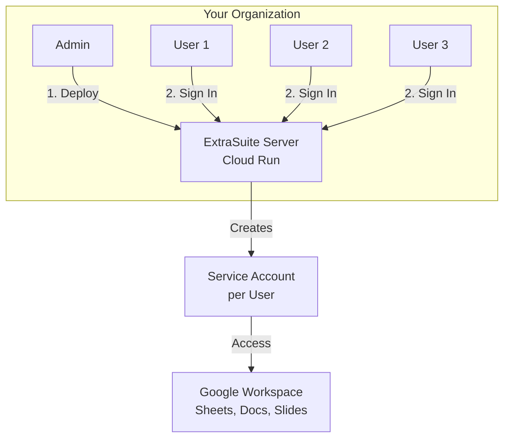

# Organization Setup

This guide walks you through setting up ExtraSuite for your organization, from server deployment to user onboarding.

---

## Overview

For organizations, ExtraSuite is deployed as a self-hosted service on Google Cloud Run. This gives you:

- **Centralized management** - One deployment serves all users
- **Domain-restricted access** - Only authorized email domains can sign in
- **Automatic service accounts** - Created per-user on sign-in
- **Audit logging** - All activity logged in Firestore
- **Token security** - Short-lived 1-hour tokens with automatic rotation



---

## Setup Steps

| Step | Action | Who |
|------|--------|-----|
| 1 | [Deploy ExtraSuite Server](#step-1-deploy-extrasuite-server) | Admin (one-time) |
| 2 | [Install AI Editor](#step-2-install-your-ai-editor) | Each User |
| 3 | [Sign Up to ExtraSuite](#step-3-sign-up-to-extrasuite) | Each User |
| 4 | [Install the Skill](#step-4-install-the-skill) | Each User |
| 5 | [Share Your Document](#step-5-share-your-document) | Each User |
| 6 | [Start Using ExtraSuite](#step-6-start-using-extrasuite) | Each User |

---

## Step 1: Deploy ExtraSuite Server

!!! info "Admin Task (One-Time Setup)"
    This step is performed **once** by an administrator. After deployment, users can sign up and start using ExtraSuite without any infrastructure knowledge.

### What You'll Need

- Google Cloud Project with billing enabled
- Admin access to configure IAM permissions
- `gcloud` CLI installed and configured

### Deploy to Google Cloud Run

Follow the complete deployment guide to set up your ExtraSuite server:

<div class="grid cards" markdown>

-   :material-cloud-upload:{ .lg .middle } **Cloud Run Deployment Guide**

    ---

    Step-by-step instructions to deploy ExtraSuite on Google Cloud Run, including:
    
    - Enabling required APIs
    - Creating OAuth credentials
    - Setting up service accounts
    - Configuring secrets
    - Deploying the server
    - Setting up domain restrictions

    [:octicons-arrow-right-24: Go to Deployment Guide](../deployment/cloud-run.md)

</div>

### After Deployment

Once deployment is complete:

1. **Note your Cloud Run URL** (e.g., `https://extrasuite-server-xxxxx.run.app`)
2. **Share this URL with your team** - Users will access ExtraSuite at this URL
3. **Verify the deployment** by visiting the URL and seeing the ExtraSuite homepage

!!! success "Ready for Users"
    Once deployed, your team can proceed with Steps 2-6 below. Share the Cloud Run URL with them to get started.

---

## Step 2: Install Your AI Editor

Before signing up, ensure you have an AI coding assistant installed.

=== "Cursor"

    1. Download and install from [cursor.com](https://cursor.com)
    2. Cursor Pro subscription recommended for full AI capabilities
    3. Open Cursor to verify installation
    
    [:octicons-arrow-right-24: Detailed Cursor Setup](installation/cursor.md)

=== "Claude Code"

    1. Install from [claude.ai/code](https://claude.ai/code)
    2. Requires Pro or Team plan
    3. Authenticate with your Anthropic account
    
    [:octicons-arrow-right-24: Detailed Claude Code Setup](installation/claude-code.md)

=== "Codex CLI"

    1. Install from [OpenAI Codex](https://openai.com/index/introducing-codex/)
    2. Requires Plus plan or higher
    3. Authenticate with your OpenAI account
    
    [:octicons-arrow-right-24: Detailed Codex Setup](installation/codex.md)

=== "Gemini CLI"

    1. Install from [Google AI](https://ai.google.dev/gemini-api/docs/aistudio-quickstart)
    2. Requires paid API key
    3. Configure your API key
    
    [:octicons-arrow-right-24: Detailed Gemini CLI Setup](installation/gemini-cli.md)

=== "Claude Coworks"

    1. Access at [claude.ai/coworks](https://claude.ai/coworks)
    2. Requires Pro or Team plan
    3. No additional installation needed
    
    [:octicons-arrow-right-24: Detailed Claude Coworks Setup](installation/claude-coworks.md)

---

## Step 3: Sign Up to ExtraSuite

1. Go to your organization's ExtraSuite instance  
   (URL provided by your admin, e.g., `https://extrasuite-server-xxxxx.run.app`)

2. Click **Sign In** or **Get Started**

3. Authenticate with your Google Workspace account

4. Your personal service account is created automatically

!!! tip "Service Account Email"
    After signing in, your service account email is displayed on the homepage. It follows the format:  
    `yourname-domain@project.iam.gserviceaccount.com`
    
    Copy this email - you'll need it to share documents.

---

## Step 4: Install the Skill

After signing in, install the ExtraSuite skill to enable Google Workspace capabilities in your AI agent.

### 4.1: Copy the Install Command

On the ExtraSuite homepage after sign-in, you'll see a personalized install command.

### 4.2: Run the Command

Open your terminal and paste the command:

=== "macOS / Linux"

    ```bash
    curl -fsSL https://your-extrasuite-url/api/skills/install/<your-token> | bash
    ```

=== "Windows (PowerShell)"

    ```powershell
    irm "https://your-extrasuite-url/api/skills/install/<your-token>?ps=true" | iex
    ```

!!! note "Token Validity"
    The install token is valid for **5 minutes**. If it expires, refresh the page to generate a new one.

### 4.3: Verify Installation

The installer will confirm which skills were installed. You can also verify manually:

=== "Cursor"
    ```bash
    ls ~/.cursor/skills/gsheets/
    ```

=== "Claude Code"
    ```bash
    ls ~/.claude/skills/gsheets/
    ```

=== "Codex CLI"
    ```bash
    ls ~/.codex/skills/gsheets/
    ```

=== "Gemini CLI"
    ```bash
    ls ~/.gemini/skills/gsheets/
    ```

You should see: `SKILL.md`, `checks.py`, `verify_access.py`, `gsheet_utils.py`, `requirements.txt`

---

## Step 5: Share Your Document

Your AI agent can only access documents you explicitly share with it.

1. Open your Google Sheet, Doc, or Slides

2. Click **Share** (top right)

3. Paste your service account email  
   (from Step 3, e.g., `yourname-domain@project.iam.gserviceaccount.com`)

4. Choose permission level:
   
   | Permission | What the Agent Can Do |
   |------------|----------------------|
   | **Viewer** | Read data, analyze content |
   | **Commenter** | Read + add comments |
   | **Editor** | Full read/write access |

5. Click **Send**

!!! tip "Start with Viewer"
    Grant Viewer access first, then upgrade to Editor only when you need the agent to make changes.

See [Sharing Documents](../user-guide/sharing.md) for best practices.

---

## Step 6: Start Using ExtraSuite

Open your AI agent and describe what you need, including the document URL:

### Example Prompts

**Read and analyze:**
```
Read the sales data from https://docs.google.com/spreadsheets/d/abc123/edit
and create a summary of Q4 revenue by region.
```

**Update a spreadsheet:**
```
Update the project plan at https://docs.google.com/spreadsheets/d/abc123/edit
with these new tasks and recalculate the timeline.
```

**Generate reports:**
```
Pull data from the CRM sheet at https://docs.google.com/spreadsheets/d/abc123/edit
and generate a weekly sales report.
```

See [Prompting Tips](../user-guide/prompting.md) for more examples.

---

## Organization Benefits

Compared to individual setup, organizations get:

| Feature | Organization Setup | Individual Setup |
|---------|:------------------:|:----------------:|
| Token expiration | 1-hour tokens | Long-lived keys |
| User management | Multi-user | Single user |
| Domain restrictions | :material-check: Supported | :material-close: N/A |
| Central audit logging | :material-check: Firestore | :material-close: N/A |
| Key rotation | Automatic | Manual |
| Service account creation | Automatic | Manual |
| Self-service sign-up | :material-check: Yes | :material-close: N/A |

---

## Troubleshooting

### Deployment Issues

See the [Deployment Guide](../deployment/cloud-run.md) and [Operations Runbook](../deployment/operations.md) for:

- Common deployment errors
- Cloud Run log analysis
- IAM permission issues

### Sign-In Issues

- Verify your email domain is in the allowed list
- Check that OAuth credentials are correctly configured
- Ensure the Cloud Run service is running and accessible

### "Spreadsheet not found" Error

- Ensure you've shared the document with your service account email
- Verify the URL is correct and the document exists
- Check that you have at least Viewer access

### Token Expired

Tokens expire after 1 hour. The skill will automatically prompt you to re-authenticate.

---

## Continue to Quick Start

You've completed the Organization Setup. Continue to the Quick Start guide to learn how to use ExtraSuite:

[:octicons-arrow-right-24: Continue to Start Using ExtraSuite](index.md#start-using-extrasuite)

---

## Additional Resources

<div class="grid cards" markdown>

-   :material-rocket-launch:{ .lg .middle } **For Admins**

    ---

    - [Deployment Guide](../deployment/index.md) - Full deployment reference
    - [IAM Permissions](../deployment/iam-permissions.md) - Required permissions
    - [Operations](../deployment/operations.md) - Managing your deployment

-   :material-account:{ .lg .middle } **For Users**

    ---

    - [User Guide](../user-guide/index.md) - Effective prompting techniques
    - [Sharing Documents](../user-guide/sharing.md) - Best practices
    - [Skills Reference](../skills/index.md) - Detailed skill documentation

</div>
