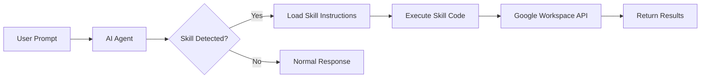

# Skills Overview

ExtraSuite provides skills that enable AI agents to work with Google Workspace applications. Each skill is a set of instructions and utilities that teach your AI agent how to interact with specific Google services.

## Available Skills

| Skill | Status | Description |
|-------|--------|-------------|
| [Google Sheets](sheets.md) | :material-check-circle:{ .text-green } **Stable** | Read, write, and manipulate spreadsheets |
| [Google Docs](docs.md) | :material-flask:{ .text-orange } **Alpha** | Create and edit documents |
| [Google Slides](slides.md) | :material-flask:{ .text-orange } **Alpha** | Build presentations |

## What is a Skill?

A skill is a package that contains:

- **SKILL.md** - Instructions for the AI agent
- **Utility scripts** - Python code for common operations
- **Requirements** - Dependencies needed to run the skill
- **Authentication helpers** - Token management and verification

When your AI agent encounters a task related to a skill (like working with a spreadsheet), it reads the skill instructions and uses the provided utilities.

## How Skills Work



### 1. Detection

The AI agent recognizes when a skill is needed based on:

- URLs in the prompt (e.g., Google Sheets URL)
- Keywords (e.g., "spreadsheet", "document")
- Explicit skill references

### 2. Loading

The agent reads the `SKILL.md` file to understand:

- How to initialize the environment
- What functions are available
- Best practices and patterns

### 3. Execution

The agent writes and runs Python code using:

- Custom utilities (e.g., `gsheet_utils.py`)
- Standard libraries (e.g., `gspread`)
- ExtraSuite authentication

### 4. Results

The agent interprets results and responds to your request.

## Skill Installation Location

Skills are installed in platform-specific directories:

| Platform | Location |
|----------|----------|
| Claude Code | `~/.claude/skills/gsheets/` |
| Codex CLI | `~/.codex/skills/gsheets/` |
| Gemini CLI | `~/.gemini/skills/gsheets/` |
| Cursor | `~/.cursor/skills/gsheets/` |

## Skill Components

Each skill directory contains:

```
gsheets/
├── SKILL.md           # Agent instructions
├── checks.py          # Environment verification
├── verify_access.py   # Access verification
├── gsheet_utils.py    # Utility functions
├── requirements.txt   # Python dependencies
└── venv/              # Virtual environment (created on first use)
```

### SKILL.md

The main instruction file that tells the AI agent:

- How to initialize the environment
- What workflow to follow
- Available functions and their usage
- Best practices and error handling

### checks.py

Verifies the environment is set up correctly:

- Python version
- Virtual environment
- Required packages
- Network connectivity

### verify_access.py

Confirms access to a specific spreadsheet:

- Tests authentication
- Verifies sharing permissions
- Provides troubleshooting guidance

### gsheet_utils.py

Custom utility functions that extend standard libraries:

- `open_sheet()` - Opens spreadsheet with authentication
- `get_shape()` - Analyzes table structure
- `has_table()` - Checks for defined tables
- `convert_to_table()` - Creates tables from ranges

## Skill Updates

Skills are updated when you re-run the install command from ExtraSuite:

```bash
curl -fsSL https://extrasuite.think41.com/api/skills/install/<your-token> | bash
```

This downloads the latest version of all skills.

## Troubleshooting

### Skill Not Recognized

If your AI agent doesn't recognize the skill:

1. Verify the skill is installed:
   ```bash
   ls ~/.claude/skills/gsheets/SKILL.md
   ```

2. Check the skill content:
   ```bash
   head -20 ~/.claude/skills/gsheets/SKILL.md
   ```

3. Try explicitly referencing the skill in your prompt:
   ```
   Using the gsheets skill, read the data from...
   ```

### Environment Issues

If the skill fails to run:

1. Run the checks script:
   ```bash
   python3 ~/.claude/skills/gsheets/checks.py
   ```

2. Verify Python is installed:
   ```bash
   python3 --version
   ```

3. Recreate the virtual environment:
   ```bash
   rm -rf ~/.claude/skills/gsheets/venv
   python3 ~/.claude/skills/gsheets/checks.py
   ```

### Authentication Issues

If authentication fails:

1. Run the verification script:
   ```bash
   ~/.claude/skills/gsheets/venv/bin/python ~/.claude/skills/gsheets/verify_access.py <url>
   ```

2. Clear cached tokens:
   ```bash
   rm -f ~/.config/extrasuite/token.json
   ```

3. Re-authenticate via the ExtraSuite website
